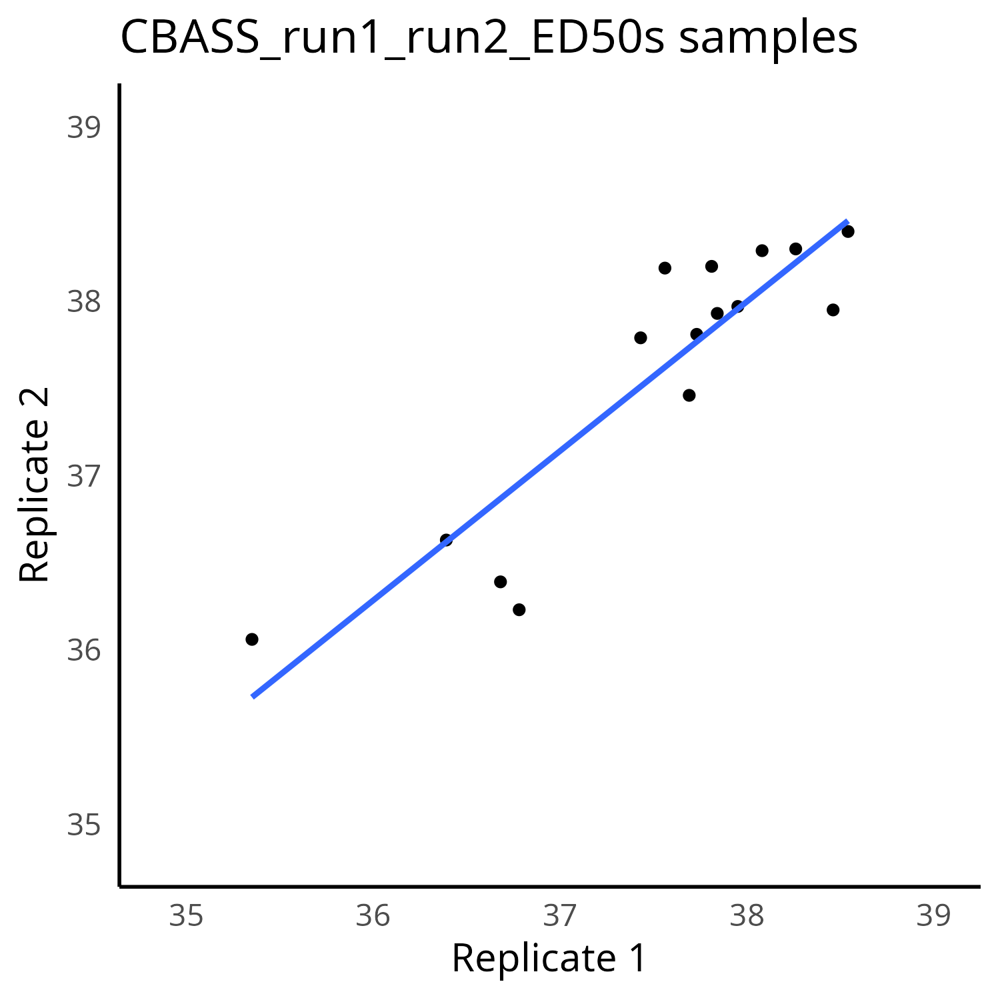
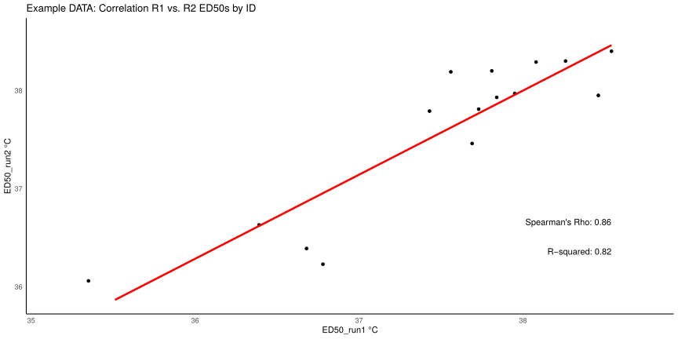

# CBASS_Replicability

We are often in a situation where we want to know how well results from one CBASS run are captured in a second run, e.g. are the top- and bottom-ranking colonies consistent between seasons, treatments, species, etc. .. the scripts here help with that in that they assess 1. linear correlation between 2 sets of ED50 values, 2. number of significant pairwise comparisions between subsets of original (how sensitive to no. of replicates?), and 3. number of falsely assigned top- or bottom-ranking colonies (e.g., to control for robustness in screening for thermally tolerant colonies)


Plots:

<!--  -->



Repo folder structure:

```text
.
├── input_example
│   └── CBASS_run1_run2_ED50s.csv
├── old_logic
│   ├── combinations.py
│   ├── Top5_Bottom5_analysis_djb.R
│   └── README.md
├── plots
│   ├── CBASS_run1_run2_ED50s_replicability_1000reps_all.pdf    <-- From running TopVsBottom_analysis.r
│   ├── ED50_replicability.pdf                                  <-- From running CBASS_replicability.r
│   ├── scatter_CBASS_run1_run2_ED50s.png                       <-- From running CBASS_replicability.r
│   └── README.md
├── TopVsBottom_analysis.r
├── CBASS_replicability.r
└── README.md
```

